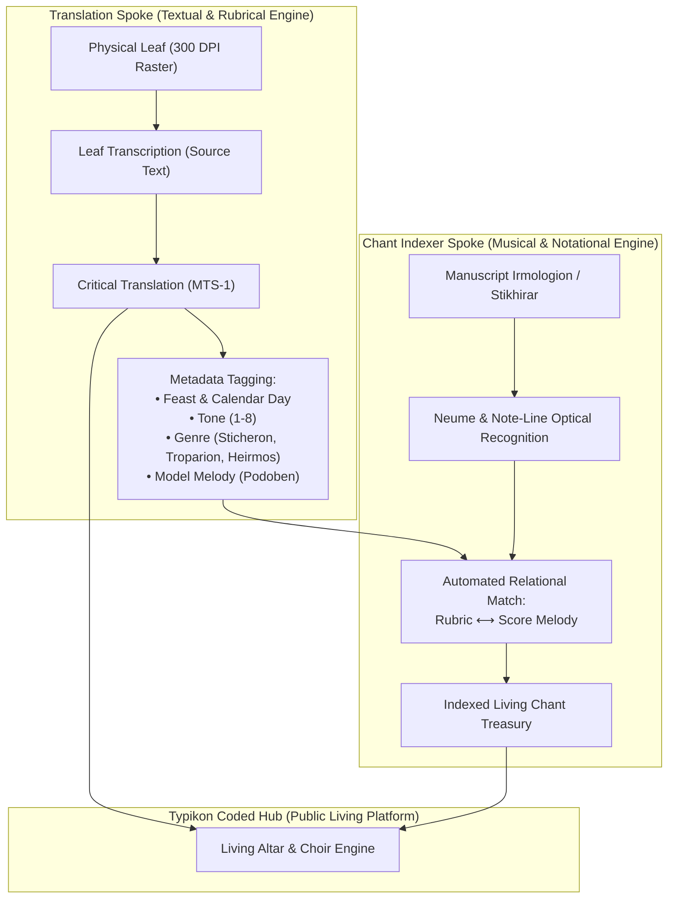

# Master Corpus of Eastern Liturgical Law & Typika (The 50 Monuments)
## Canonical Transmission Chain & Multimodal Training Architecture for the Translation & Chant Indexer Spokes

> [!IMPORTANT]
> **Executive Architecture & Strategic Mandate**  
> This specification codifies the **50 Monument Master Canon** of the Byzantine-Ruthenian liturgical tradition.  
> It establishes a unified documentary foundation bridging 1,200 years of liturgical history (8th century to 2010 AD).  
> In addition to delivering open-access English critical editions, this corpus serves as the **progressive Curriculum Learning pipeline** generating tens of thousands of leaf-aligned vision-text pairs to train models on classical typography, Cyrillic incunabula (*полуустав*), and medieval Byzantine/Slavonic manuscript paleography for direct integration into the **Chant Indexer Spoke**.

---

## 1. Five-Tier Curriculum Learning & Paleographical Matrix

| Tier | Historical Era & Script Type | Representative Monuments | Machine Learning & Vision Paleography Focus |
|---|---|---|---|
| **Tier I: Modern Scholarly Typography** | 1850–2010 (Clear 19th/20th c. typography, pre-reform Russian, polytonic Greek, Church Slavonic) | Mon. 0–8 (Violakis, Dolnytsky, Skaballanovich, Dmitrievsky) | Master liturgical vocabulary, tone structures (Tones 1–8), LXX biblical versification, dual Greek/Slavonic apparatus, bijective footnote alignment. |
| **Tier II: The Rome Recension & Pre-Nikonian Typika** | 1610–1955 (Pre-Nikonian Slavonic woodblock fonts, Latin-Slavonic editio typica) | Mon. 9–16 (Radishevsky 1610, Philaret 1633, Ordo Celebrationis 1944) | Early Cyrillic woodblock type, rubric cinnabar ink separation, titla abbreviations, pre-schism versus post-schism liturgical divergence. |
| **Tier III: Kyivan Baroque Incunabula** | 1574–1761 (Kyivan semi-uncial *полуустав*, decorative *vyaz'*, Pochayiv Basilian editions) | Mon. 17–25 (Fedorov 1574, Mohyla 1632/1646, Pochayiv 1738) | Historical ligature fonts, obsolete glyphs (ѣ, ѧ, ѫ, ѯ, ѱ, ѳ, ѵ), complex monastic rubrics, cantor tone indicators (*Hlasopisnets*). |
| **Tier IV: Classical Byzantine Manuscript Roots** | 8th–14th c. (Byzantine cursive, minuscule codices, Sinaitic & Athonite folios) | Mon. 26–36 (Dmitrievsky Vols. 1–3, Mateos Hagia Sophia, Philotheus Diataxis) | Direct manuscript paleography, reading archival ink and damaged folios, unedited marginal rubrics. |
| **Tier V: Devotionalia, Synodal Decrees & Comparative Traditions** | 1596–1988 (Synodal acts, paraliturgical hymnody, Armenian & Syrian comparative rites) | Mon. 37–50 (Zamość, Kobryn, Bohohlasnyk, Armenian Jamagirk, Baumstark) | Comparative Eastern liturgical theology, hymnographic meter, paraliturgical chant alignment. |

---

## 2. Complete Codex Inventory: Monuments 1 to 50

### Tier I: The Great Typika & Academic Summits (Monuments 0–8)
*All physical facsimile leaves verified on Drive E: master vault.*

1. **Monument 0: 2010 Lviv Synodal Typikon** (`2010_lviv_typikon`)
   - *Title*: Typikon of the Ukrainian Greek-Catholic Church (*Типик УГКЦ*, Lviv, 2010)
   - *Scope*: 287 physical leaves | *Register*: Rubrical | *Status*: Primed
   - *Source*: `2010 Lviv Typikon/Typyk UHKC(укр).pdf`
2. **Monument 1: 1891 Lviv Provincial Synod** (`1891_lviv_synod`)
   - *Title*: Acts and Decrees of the Ruthenian Provincial Synod of Lviv (1891)
   - *Scope*: 278 physical leaves | *Register*: Juridical | *Status*: **100% Sealed & Ingested**
3. **Monument 2: 1899 Dolnytsky Typikon** (`1899_dolnytsky_typikon`)
   - *Title*: Typik of the Ruthenian-Catholic Church (Fr. Isidore Dolnytsky, Lviv Stauropegion, 1899)
   - *Scope*: 591 physical leaves | *Register*: Rubrical | *Status*: **100% Sealed & Ingested**
4. **Monument 3: 1901 Mikita Typikon** (`1901_mikita_typikon`)
   - *Title*: Typikon of the Ruthenian-Catholic Church (Fr. Alexander Mikita, Mukachevo-Uzhhorod, 1901)
   - *Scope*: 320 physical leaves | *Register*: Rubrical | *Status*: **100% Sealed & Ingested**
5. **Monument 4: 1852 Doskovsky Typikon** (`1852_doskovsky_typikon`)
   - *Title*: Typikon of the Church or Order of Divine Worship (Fr. Jacob Doskovsky, Peremyshl, 1852)
   - *Scope*: 141 physical leaves | *Register*: Rubrical | *Status*: **100% Sealed & Ingested**
6. **Monument 5: 1888 Violakis Typikon** (`1888_violakis_typikon`)
   - *Title*: Typikon of the Great Church of Christ (George Violakis, Ecumenical Patriarchate, Constantinople, 1888)
   - *Scope*: 1,170 physical leaves | *Register*: Rubrical | *Status*: **100% Sealed & Ingested**
7. **Monument 6: 1910 Skaballanovich Typikon** (`1910_skaballanovich_typikon`)
   - *Title*: Tolkovy Typikon of Mikhail Skaballanovich (Kyiv Theological Academy, 1910–1915)
   - *Scope*: 1,022 physical leaves (2,834 critical footnotes) | *Register*: Scholarly Critical | *Status*: **100% Sealed & Ingested**
8. **Monument 7: 1895 Dmitrievsky Opisanie Vol. 1: Typika** (`1895_dmitrievsky_vol1`)
   - *Title*: Description of Liturgical Manuscripts Vol. 1: Typika (Aleksei Dmitrievsky, Kyiv, 1895)
   - *Scope*: 1,090 physical leaves | *Register*: Scholarly Critical | *Status*: **Ready for Execution**
9. **Monument 8: 1917 Dmitrievsky Opisanie Vol. 3: Typika Part 2** (`1917_dmitrievsky_vol3`)
   - *Title*: Description of Liturgical Manuscripts Vol. 3: Typika Part 2 (Aleksei Dmitrievsky, Petrograd, 1917)
   - *Scope*: 789 physical leaves | *Register*: Scholarly Critical | *Status*: Primed

---

### Tier II: Ancient Synods, Euchologia & The Rome Recension (Monuments 9–16)

10. **Monument 9: 1720 Provincial Synod of Zamość** (`1720_zamoysky_fedoriv`)
    - *Title*: Acts and Decrees of the Provincial Synod of Zamość (1720, ed. Fedoriv, Rome, 1972)
    - *Scope*: 75 physical leaves | *Register*: Juridical | *Source*: `Historical Typikons/1972-Fedoriv-Zamoysky-Synod-1720.pdf`
11. **Monument 10: 2004 Galadza Sheptytsky** (`2004_galadza_sheptytsky`)
    - *Title*: The Theology and Liturgical Work of Andrei Sheptytsky (Peter Galadza, Rome, 2004)
    - *Scope*: 537 physical leaves | *Register*: Scholarly Critical | *Source*: `Historical Typikons/2004-Galadza-Theology-and-Liturgical-Work-of-Andrei-Sheptytsky.pdf`
12. **Monument 11: Great Sabbas Synodal Typikon** (`great_sabbas_synodal`)
    - *Title*: Great Sabbas Synodal Typikon (Church Slavonic Moscow Synodal Edition)
    - *Scope*: 816 physical leaves | *Register*: Rubrical | *Source*: `Historical Typikons/Great-Sabbas-Synodal-Typikon-Church-Slavonic.pdf`
13. **Monument 12: 1901 Dmitrievsky Opisanie Vol. 2: Euchologia** (`1901_dmitrievsky_vol2`)
    - *Title*: Description of Liturgical Manuscripts Vol. 2: Euchologia (Aleksei Dmitrievsky, Kyiv, 1901)
    - *Scope*: 1,103 physical leaves | *Register*: Scholarly Critical | *Source*: `Historical Typikons/1901-Dmitrievsky-Opisanie-Vol2-Euchologia.pdf`
14. **Monument 13: 1944/1955 Ordo Celebrationis (Rome Ruthenian Editio Typica)** (`1944_ordo_celebrationis`)
    - *Title*: Ordo Celebrationis Vesperarum, Matutini et Divinae Liturgiae Iuxta Recensionem Ruthenam (Sacra Congregatio pro Ecclesia Orientali, Rome, 1944/1955)
    - *Scope*: 163 physical leaves | *Register*: Rubrical / Juridical | *Source*: `3. Modern Service Books and Typikons/.../Ordo Celebrationis 1955.pdf`
15. **Monument 14: 1610 Onisim Radishevsky Typikon (*Oko Tserkovnoe*)** (`1610_oko_radishevsky`)
    - *Title*: Eye of the Church: Typikon of the Church Service (Onisim Radishevsky, Moscow, 1610)
    - *Scope*: 1,266 physical leaves | *Register*: Rubrical / Incunabula | *Source*: `2. Historical Liturgical Texts/Pre-Nikonian_Typika/.../1610-Typikon-Onisim-Radishevsky.pdf`
16. **Monument 15: 1633 Patriarch Philaret Typikon (*Oko Tserkovnoe*)** (`1633_oko_philaret`)
    - *Title*: Eye of the Church (Patriarch Philaret Romanov, Moscow, 1633)
    - *Scope*: 637 physical leaves | *Register*: Rubrical / Incunabula | *Source*: `2. Historical Liturgical Texts/Pre-Nikonian_Typika/.../1633-Typikon-Patriarch-Philaret.pdf`
17. **Monument 16: 1641 Pre-Nikonian Typikon (*Oko Tserkovnoe*)** (`1641_oko_prenikonian`)
    - *Title*: Eye of the Church: The Great Pre-Nikonian Typikon (Patriarch Joseph, Moscow, 1641)
    - *Scope*: 2,367 physical leaves | *Register*: Rubrical / Incunabula | *Source*: `2. Historical Liturgical Texts/Pre-Nikonian_Typika/.../1641-Typikon-Pre-Nikonian.pdf`

---

### Tier III: The Kyivan Baroque & Monastic Legislation (Monuments 17–25)

18. **Monument 17: 1632 Petro Mohyla Archieratikon / Sluzhebnyk** (`1632_mohyla_archieratikon`)
    - *Title*: Hieratikon and Euchologion of Metropolitan Petro Mohyla (Kyiv-Pechersk Lavra, 1632)
    - *Scope*: 248 physical leaves | *Register*: Rubrical / Sacerdotal | *Source*: `2. Historical Liturgical Texts/Kyivan_Recension/.../Kyiv_1632_Petro_Mohyla.pdf`
19. **Monument 18: 1646 Petro Mohyla Great Trebnyk** (`1646_mohyla_trebnyk`)
    - *Title*: Evkhologion albo Molitvoslov (Metropolitan Petro Mohyla, Kyiv-Pechersk Lavra, 1646)
    - *Scope*: 1,500 physical leaves | *Register*: Sacerdotal / Ritual | *Source*: `Kyivan Recension Trebnyks`
20. **Monument 19: 1894 Isidore Dolnytsky — *Hlasopisnets*** (`1894_dolnytsky_hlasopisnets`)
    - *Title*: Book of Tones: Manual for the Eight Tones and Model Melodies (Fr. Isidore Dolnytsky, Lviv Stauropegion, 1894)
    - *Scope*: 298 physical leaves | *Register*: Rubrical / Hymnographic (Direct Chant Indexer Bridge) | *Source*: `1. Music and Chant Monuments/Irmologia/.../1894 Lviv Dolnytsky Hlasopisnets.pdf`
21. **Monument 20: 1617–1636 Basilian General Chapters Acts & Rules** (`1617_basilian_rules`)
    - *Title*: Acts and Rules of the General Chapters of the Order of Saint Basil the Great (1617–1636, Analecta OSBM Vol. 55)
    - *Scope*: 512 physical leaves | *Register*: Juridical / Monastic | *Source*: `2. Historical Liturgical Texts/Kyivan_Recension/.../OSBM-Vol55.pdf`
22. **Monument 21: 1950 Rome Ruthenian Chasoslov (Horologion)** (`1950_rome_chasoslov`)
    - *Title*: Chasoslov: Book of Hours of the Ruthenian Recension (Sacra Congregatio pro Ecclesia Orientali, Rome, 1950)
    - *Scope*: 1,267 physical leaves | *Register*: Rubrical / Hymnographic | *Source*: `2. Historical Liturgical Texts/Ruthenian_Galician/.../Rome_1950_Chasoslov.pdf`
23. **Monument 22: 1738 Pochayiv Anthologion (*Tsvitoslov*)** (`1738_pochaiv_anthologion`)
    - *Title*: Anthologion or Sbornik of Divine Services for Feasts (Pochayiv Lavra Press, 1738)
    - *Scope*: 1,213 physical leaves | *Register*: Hymnographic / Rubrical | *Source*: `2. Historical Liturgical Texts/Kyivan_Recension/.../Pochayiv Anthologion 1738.pdf`
24. **Monument 23: 1906–1907 Lviv Stauropegion Seasonal Triodia Rubrics** (`1906_lviv_triodia`)
    - *Title*: Lenten Triodion (1906) & Paschal Pentikostarion (1907) Rubrical Apparatus (Lviv Stauropegion)
    - *Scope*: 1,203 physical leaves (532 + 671) | *Register*: Rubrical / Hymnographic | *Source*: `Ruthenian_Galician/Triodia/`
25. **Monument 24: 1761 Pochayiv Menaion Rubrical Directives** (`1761_pochaiv_minea`)
    - *Title*: Pochayiv Menaion: Complete 12-Month Rubrical Directives and Sanctoral Ordo (Pochayiv Lavra, 1761)
    - *Scope*: ~3,500 physical leaves (12 vols.) | *Register*: Rubrical / Hymnographic | *Source*: `Ruthenian_Galician/Menaia/`
26. **Monument 25: 1988 UGCC Synod Liturgikon** (`1988_ugcc_liturgikon`)
    - *Title*: Liturgikon: Divine Liturgies of St. John Chrysostom, St. Basil the Great, and Presanctified Gifts (UGCC Synod, Rome, 1988)
    - *Scope*: 322 physical leaves | *Register*: Sacerdotal / Rubrical | *Source*: `3. Modern Service Books and Typikons/.../Liturgikon 1988.pdf`

---

### Tier IV: Classical Byzantine Manuscript Codices (Monuments 26–36)

27. **Monument 26: Typikon of the Great Church (Hagia Sophia, 10th c.)** (`10th_c_hagia_sophia`)
    - *Title*: Le Typicon de la Grande Église (Codex Patmos 266 & Jerusalem Stavrou 40, ed. Juan Mateos, Rome, 1962)
28. **Monument 27: Studite-Alexian Typikon (1034 AD)** (`1034_studite_alexian`)
    - *Title*: The Typikon of Patriarch Alexius the Studite for the Monastery of the Dormition (Synodal MS 330)
29. **Monument 28: Evergetis Typikon (11th c. Constantinople)** (`11th_c_evergetis`)
    - *Title*: The Hypotyposis and Synaxarion of the Monastery of the Theotokos Evergetis (ed. Robert Jordan)
30. **Monument 29: Pantokrator Monastery Typikon (1136 AD)** (`1136_pantokrator`)
    - *Title*: Imperial Typikon of Emperor John II Comnenus for the Pantokrator Monastery
31. **Monument 30: Diataxis of Patriarch Philotheus Kokkinos (14th c.)** (`14th_c_philotheus_diataxis`)
    - *Title*: Diataxis tes Theias Leitourgias kai tes Agrypnias (Philotheus Kokkinos, Patriarch of Constantinople)
32. **Monument 31: Barberini Euchologion gr. 336 (8th c.)** (`8th_c_barberini_336`)
    - *Title*: The Barberini Euchologion (Vatican Library, Barberini gr. 336, oldest Byzantine prayer codex)
33. **Monument 32: Jacques Goar’s *Euchologion sive Rituale Graecorum* (Paris, 1647)** (`1647_goar_euchologion`)
    - *Title*: Euchologion sive Rituale Graecorum complectens Ritus et Ordines Divinae Liturgiae (Jacques Goar, O.P.)
34. **Monument 33: F. E. Brightman’s *Liturgies Eastern and Western* (Oxford, 1896)** (`1896_brightman_liturgies`)
    - *Title*: Liturgies Eastern and Western, Vol. 1: Eastern Liturgies (Frank Edward Brightman, Clarendon Press)
35. **Monument 34: 1574 Ivan Fedorov Lviv Apostolos** (`1574_fedorov_apostolos`)
    - *Title*: The Lviv Apostolos with Liturgical Calendar and Historical Afterword (Ivan Fedorov, Lviv, 1574)
    - *Scope*: 556 physical leaves | *Source*: `Kyivan_Recension/Apostolos/Lviv_1574_Ivan_Fedorov_Apostolos.pdf`
36. **Monument 35: 1581 Ostroh Bible Liturgical Appendices** (`1581_ostroh_bible_tables`)
    - *Title*: The Ostroh Bible: Liturgical Lectionary Tables and Calendar Ordo (Prince K. Ostrozky, Ostroh, 1581)
    - *Scope*: 1,232 physical leaves | *Source*: `Kyivan_Recension/Bibles/Ostroh_1581_Ivan_Fedorov_Ostroh_Bible.pdf`

---

### Tier V: Devotionalia, Synodal Acts & Comparative Rites (Monuments 37–50)

37. **Monument 36: 1619 Pamvo Berynda Kyiv Anthologion** (`1619_berynda_anthologion`)
    - *Scope*: 1,066 physical leaves | *Source*: `Kyivan_Recension/Anthologia/Kyiv_1619_Anthologion.pdf`
38. **Monument 37: 1629 Kyiv-Pechersk Octoechos** (`1629_kyiv_octoechos`)
    - *Scope*: 118 physical leaves | *Source*: `Kyivan_Recension/Octoechos/Kyiv_1629_Octoechos.pdf`
39. **Monument 38: 1640 Kyiv Lenten Triodion** (`1640_kyiv_triodion`)
    - *Scope*: 896 physical leaves | *Source*: `Kyivan_Recension/Triodia/Kyiv_1640_Lenten_Triodion.pdf`
40. **Monument 39: 1596 Synod of Brest Union Documents & Liturgical Declarations** (`1596_brest_synod`)
41. **Monument 40: 1626 Synod of Kobryn Decrees** (`1626_kobryn_synod`)
    - *Decrees of Metropolitan Joseph Veliamyn Rutsky on Liturgical Uniformity*
42. **Monument 41: 1941 Metropolitan Andrei Sheptytsky — Archdiocesan Sobor Decrees** (`1941_sheptytsky_sobor`)
43. **Monument 42: 1901 Lviv Stauropegion Psaltyr with Kathismata Rubrics** (`1901_lviv_psalter`)
    - *Scope*: 286 physical leaves | *Source*: `Ruthenian_Galician/Psalteria/1901-Psaltyr-Lviv.pdf`
44. **Monument 43: 1790 Pochayiv *Bohohlasnyk* (Liturgical Songbook & Melodic Rubrics)** (`1790_pochaiv_bohohlasnyk`)
    - *Scope*: 601 physical leaves | *Source*: `1. Music and Chant Monuments/.../Bohohlasnyk 1790.pdf`
45. **Monument 44: 1893 Lviv Basilian *Akafistnik* & Devotional Ordo** (`1893_lviv_akafistnik`)
    - *Scope*: 460 physical leaves | *Source*: `Galician_Recension/Akafistniki/Lviv_1893_Akafistnik.pdf`
46. **Monument 45: 1905 Zhovkva Basilian *Akafistnik*** (`1905_zhovkva_akafistnik`)
    - *Scope*: 425 physical leaves | *Source*: `Galician_Recension/Akafistniki/Zhovkva_1905_Akafistnik.pdf`
47. **Monument 46: 1944 Cyril Korolevsky — Liturgical Directives for the Ruthenian Recension** (`1944_korolevsky_directives`)
48. **Monument 47: Armenian Jamagirk (1902 Vagharshapat Print)** (`1902_armenian_jamagirk`)
    - *Title*: The Armenian Book of Hours (Horologion) with Choral Directives
    - *Scope*: 363 physical leaves | *Source*: `07. Comparative & Historical Rites/Armenian_Rite/.../Jamagirk 1902.pdf`
49. **Monument 48: F. C. Conybeare’s *Rituale Armenorum* (Oxford, 1905)** (`1905_conybeare_rituale_armenorum`)
    - *Scope*: 97 physical leaves | *Source*: `07. Comparative & Historical Rites/Armenian_Rite/Conybeare.pdf`
50. **Monument 49: Anton Baumstark’s *Festbrevier und Kirchenjahr der syrischen Jakobiten* (Paderborn, 1910)** (`1910_baumstark_festbrevier`)
51. **Monument 50: 1906 Isabel Florence Hapgood Service Book Commentary & Rubrics** (`1906_hapgood_service_book`)

---

## 3. Data Flow to the Chant Indexer Spoke

Every completed cohort in the Translation spoke exports a structured JSON metadata sidecar directly into the Chant Indexer inbox, enabling automatic hymnographic discovery and melodic indexing across the entire Ruthenian musical treasury.
