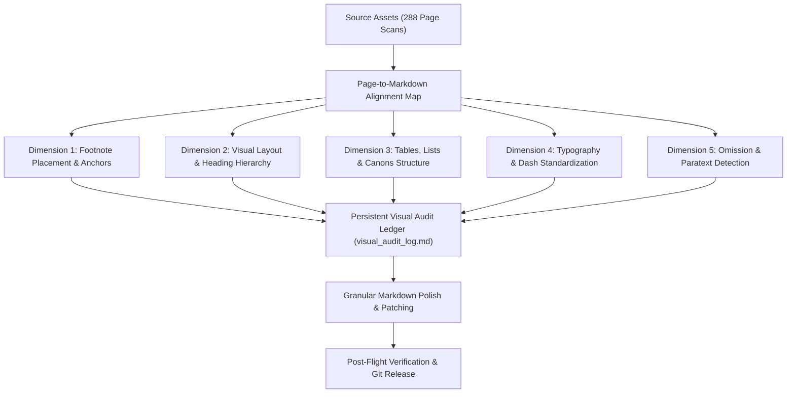

# Implementation Plan: Visual & Typographic Verification (`liturgical_vision_auditor`)

A comprehensive verification pipeline to audit the English Markdown translation corpus (`Final MD/`) against the 288 original Ukrainian page-scan images (`Typyk UHKC(укр)-001.jpg` to `287.jpg`), Ukrainian source PDFs, and reference texts. This ensures 100% layout fidelity, exact footnote positioning, typographic consistency, and zero text omissions.

---

## 1. Project Background & Source Assets

### Source Assets Available in Workspace
* **Page-Scan Image Mirror:** `Typyk UHKC pdf jpgs/` containing 288 high-resolution page scans (`Typyk UHKC(укр)-001.jpg` to `Typyk UHKC(укр)-287.jpg`).
* **Ukrainian Source PDFs:** `Ukrainian PDFs/` (`Intro.pdf`, `Part 1.pdf` through `Part 5.pdf`).
* **Ukrainian Reference Text:** `Ukrainian TXTs/` (`Intro.txt`, `Part 1.txt` through `Part 5.txt`, `Appendix.txt`, `Footnotes.txt`).
* **Target English Markdown Corpus:** `Final MD/` (`Final_Dolnytsky_intro.md`, `Final_Dolnytsky_part1_structure.md`, `Final_Dolnytsky_part2_general_rubrics.md`, `Final_Dolnytsky_part3_menaion.md`, `Final_Dolnytsky_part4_triodion.md`, `Final_Dolnytsky_part5_temple.md`, `Final_Dolnytsky_appendix.md`, `Final_Dolnytsky_glossary.md`, `Final_footnotes.md`).

---

## 2. Core Audit Objectives & Verification Dimensions

### 1. Footnote Placement & Superscript Fidelity
* Validate that every footnote marker (`[^N]`) in the English Markdown matches the exact physical location and paragraph anchor in the original printed page scan.
* Ensure no footnote markers are detached, orphaned, or duplicated across page boundaries.
* Verify 100% coverage in `Final_footnotes.md` for every visual footnote printed in the source.

### 2. Visual Layout & Heading Hierarchy
* Verify that major headings (`#`, `##`, `###`) match the visual hierarchy of the printed Ukrainian edition (e.g. large capitals for major feasts, small caps for sub-services).
* Ensure temporal conditions (`#### On Weekdays`, `#### On a Sunday`) and service names (`##### At Great Vespers`, `##### At Matins`) accurately reflect the visual rubrical divisions.
* Check that dialogue formatting (Priest / Deacon exchanges) reflects original margin indentations and speaker labels.

### 3. Tables, Schemes & Canon Deconstruction
* Verify complex tabular layouts against the original scans:
  * Monthly Katavasia table / seasonal Katavasia distributions.
  * Lenten Triodion 3-ode combinations (Monday to Friday ode allocations).
  * Fasting rules & dairy allowance tables in Cheesefare and Great Lent.
  * Censing paths and liturgical diagrams in Part 1 and Part 5.

### 4. Typography & Punctuation Standards
* **Dash Consistency:** Enforce standard en dashes (` – `) or em dashes (` — `) for parentheticals and sentence pauses, eliminating loose raw hyphens (`-`).
* **Quotation & Incipits:** Standardize curved quotation marks (*“...”*) and italics for incipits (*“God is the Lord”*, *“Lord, I have cried”*) and liturgical book names (*Octoechos*, *Menaion*, *Horologion*, *Sluzhebnik*).
* **Rubric Formatting:** Ensure parenthetical instructions (*(with 3 bows)*, *(quietly)*) are formatted consistently in italics.

### 5. Omission & Paratext Gate
* Detect and eliminate any omissions in marginal notes, rubric caveats, or parenthetical references present in the source scans.

---

## 3. Proposed Phased Execution Plan

### Phase 1: Re-align Page-to-Markdown Mapping Ledger
* Update `visual_audit_log.md` to map all 288 images (`Typyk UHKC(укр)-001.jpg` to `287.jpg`) to the newly reorganized `.md` files in `Final MD/` with exact line number ranges:
  * **Images 001–005:** `Final_Dolnytsky_intro.md` (Title, Dedication, Publisher's Foreword, Table of Contents).
  * **Images 006–022:** `Final_Dolnytsky_part1_structure.md` (General View of Divine Services, 1.1–1.7).
  * **Images 023–053:** `Final_Dolnytsky_part2_general_rubrics.md` (20 General Service Paradigms, 2.1–2.20).
  * **Images 054–146:** `Final_Dolnytsky_part3_menaion.md` (Menaion Feasts, September to August).
  * **Images 147–210:** `Final_Dolnytsky_part4_triodion.md` (Lenten & Flowery Triodion).
  * **Images 211–247:** `Final_Dolnytsky_part5_temple.md` (Temple Rubrics).
  * **Images 248–287:** `Final_Dolnytsky_appendix.md` (*Ordo Celebrationis* & Footnotes).

### Phase 2: Build Automated Visual Audit Tool (`scratch/visual_auditor.py`)
* Construct an auditor script integrating `pathlib` relative paths and DeepSeek API / vision inspection:
  * Load page scan metadata and OCR text from images.
  * Extract Markdown chunks corresponding to each page's line range.
  * Perform programmatic checks: footnote presence, heading presence, list item count, table structure, dash conventions.
  * Generate an automated anomaly detection report (`Audit_Reports/visual_audit_discrepancies.json`).

### Phase 3: Segment-by-Segment Visual Audit Execution
Run the audit sequentially across all 6 segments:
1. **Intro & Part 1 (Images 001–022):** Verify dialogues, censing diagrams, and introductory rubrics.
2. **Part 2 (Images 023–053):** Verify 20 service rubrics, Canon distributions, and footnotes 44–240.
3. **Part 3 (Images 054–146):** Verify all 12 Menaion calendar months, feast titles, and footnotes 241–465.
4. **Part 4 (Images 147–210):** Verify Lenten Triodion and Pentecostarion schemas, ode sequences, and footnotes 466–662.
5. **Part 5 (Images 211–247):** Verify Temple feast rubrics, procession instructions, and footnotes 663–752.
6. **Appendix & Footnotes (Images 248–287):** Verify *Ordo Celebrationis* 160+ numbered rules, sanctuary setup, and footnotes 753–785.

### Phase 4: Remediation & Typographic Polish
* Apply targeted patches for any detected discrepancies (dash fixes, italicization adjustments, table alignments, or footnote marker recalibrations).
* Update `visual_audit_log.md` with completed verification timestamps and notes for all 288 pages.

### Phase 5: Verification & Downstream Sync
* Run `scratch/search_anti_patterns.py` to confirm 0 regressions.
* Run footnote verification to guarantee 100% bidirectional mapping.
* Stage, commit, and push changes to `origin/master`.
* Sync updated files to the Typikon Coded Hub inbox (`Projects/Typikon Coded/Data/Inbox/`).

---

## 4. Verification Plan

### Automated Verification
* `python scratch/search_anti_patterns.py`: Confirm 0 anti-pattern violations.
* Footnote integrity script: Confirm 100% bidirectional coverage (0 missing/orphaned footnotes).
* Markdown lint & structure verification: Verify all tables, headings, and lists render cleanly without broken syntax.

### Manual / Visual Verification
* Spot-check complex visual artifacts against scans:
  * Table of Katavasias in Part 2 and Part 3.
  * Lenten Triodion ode allocation schema in Part 4 (Cheesefare/Lent).
  * Temple feast procession & blessing diagrams in Part 5.

---

## User Review Required

> [!IMPORTANT]
> **Scope Confirmation:**
> The visual audit covers all 288 source page-scan images (`Typyk UHKC(укр)-001.jpg` to `287.jpg`) mapped to the newly reorganized `.md` files in `Final MD/`. Please confirm if you approve this implementation plan to begin Phase 1.
