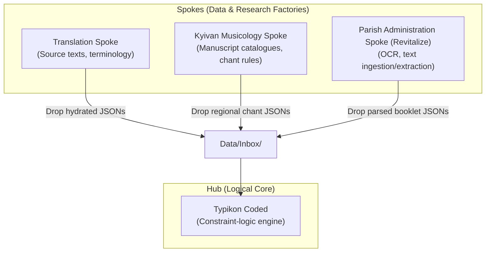

# Comprehensive Onboarding Assessment

This document outlines the architecture, status, gaps, and limits of the **Typikon Coded** ecosystem. It serves as the baseline onboarding record for this session.

---

## 1. Hub-and-Spoke Fractal Architecture

The ecosystem is structured around a centralized logical brain (the **Hub**) fed by specialized auxiliary projects (the **Spokes**). 



### The Hub: Typikon Coded (`Projects/Typikon Coded`)
The central constraint-logic engine that calculates liturgical context, resolves Dolnytsky general paradigms, and orders service layouts.
#### 5-Wing Structure of the Hub:
1. **Wing 1: Core Logic Engine (`engine/`)**
   * Composed of 16 mixin-based Python modules inheritance structure resolving Rubrics, Calendar (Julian/Gregorian compute), Vespers, Matins, Hours, Liturgy, Compline, Lenten, and Paschal variants.
2. **Wing 2: Service Structures (`json_db/01*_struct_*.json`)**
   * Service order sequence templates. 100% complete, mapping every liturgical ordinary slot and dynamic logical slot.
3. **Wing 3: Data Assets & Recensions (`assets/`, `json_db/stamford/`)**
   * Localized translations (currently primarily Stamford 2014 Recension) which hydrate the logic engine's resolved slots.
4. **Wing 4: Documentation & Encyclopedia (`.agent/brain/`, `.ai/learnings.md`)**
   * Deep memory, rules of authority (Ordo 1944 > Dolnytsky > Liturgicon), anti-patterns, and past session handoffs.
5. **Wing 5: UI, Output & API (`cantor_dashboard/`, `generated_digests/`)**
   * The browser-based Web UI dashboard for Cantors (`index.html`, `main.js`, `server.py`) and generated text reference documents.

---

### The Spokes

#### Spoke 1: Translation (`Projects/Translation`)
* **Role**: Translating source texts and establishing terminology.
* **Wing structure**:
  * **Wing A**: Procedural chunking and structural segmenting (by chapters, bullet lists, and paragraphs).
  * **Wing B**: Philological review logs and visual audit protocol (`visual_audit_log.md`).
* **Milestone**: Translated 100% of Father Dolnytsky's *Typik* into Markdown in `Typikon Coded/Data/Service Books/Typikon/`.

#### Spoke 2: Kyivan Musicology (`Projects/Kyivan Musicology`)
* **Role**: Ingesting historical manuscript catalogs and chant structures.
* **Wing structure**:
  * **Wing A (Catalogue)**: The Yasinovsky Manuscript Catalogue (525 catalog entries of offline/lost manuscripts).
  * **Wing B (Research & PDFs)**: Scholarly articles and relative notation primers compiled into academic PDFs.
* **Milestone**: Shipped regional chant rules JSON and OBikhod MEI melodies to the Hub's Inbox.

#### Spoke 3: Parish Administration (Revitalize) (`Projects/Parish Administration`)
* **Role**: Bulk document extraction, OCR, and choir booklet prep.
* **Wing structure**:
  * **Wing A**: Raw draft processing and MS Word formatting styling checklists.
  * **Wing B**: Standardized ledger database cataloging (`Central_Registry_Ledger.csv`).

---

## 2. Codebase Forensic Status

To verify the codebase status, active test suites and diagnostic tools were executed:

### 2.1 Test Suite Verification
The complete test suite was run via `pytest`. All **318 tests passed** in **11.79 seconds**.

```
============================ 318 passed in 11.79s =============================
```

> [!NOTE]
> The test suite includes critical sanity checks:
> - `test_annual_almanac_consistency.py` - Ensures cached almanac variables align with live engine calculations.
> - `test_gold_standard_truth.py` - Verifies class/rank/case resolution for 13 canonical dates.
> - `test_matins_stress_2_saints.py` - Ensures canon stacking, sessional distributions, and sessional overrides align with Dolnytsky Part II Line 31.

### 2.2 Database Linter Verification
The database linter (`scripts/lint_liturgical_db.py`) was executed:
- **Status**: Completed successfully.
- **Scope**: Checked 14 JSON text files.
- **Issues**: Identified **22,222 stylistic/terminology issues**.
  * **Potential Lowercase Deity Pronouns**: 7,153 (e.g. *you*, *he*, *his* referring to Christ/God without capitalization).
  * **Missing Hieratic Capitalizations**: 78.
  * **Typographical Standards (Breath Markers)**: 14,866 (e.g. breath marker `*` missing leading/trailing spaces).
  * **Terminology Drift**: 125.

---

## 3. Gaps & Limits Assessment

### 3.1 Logical Engine Gaps (Wing 1 & 2)
The core logic engine is highly complete (100% logic coverage of standard cases), but some edge items are flagged as pending or stubs:
1. **Theotokion Selection Matrix**: Needs a comprehensive 8-tone × 7-day lookup mapping instead of simpler placeholder falls.
2. **Sunday Gospel Sticheron Placement**: Displacement logic (Dolnytsky Part II lines 357, 389) needs explicit handling.
3. **Clergy Variant Axis**: Skeletons do not dynamically adapt depending on the presence of a deacon vs. priest-only vs. hierarchical serving.

### 3.2 Data Completeness Limits (Wing 3)
Because the Hub relies on Spokes to populate the Stamford Recension assets, there is a massive text hydration gap:

| Book | Target Elements | Current | Gap % |
|------|:---:|:---:|:---:|
| Octoechos | ~800 | ~256 | 68% |
| Menaion | ~4,250 | ~128 | 97% |
| Triodion | ~1,000 | ~100 | 90% |
| Pentecostarion | ~500 | ~20 | 96% |
| **Total** | **~6,550** | **~504** | **92%** |

> [!IMPORTANT]
> The Stamford database is deliberately abridged (~10% of full library). Complete data hydration is blocked until the Spokes output further parsed text assets to the Hub's Inbox.

### 3.3 Database Quality & Consistency Gaps
The 22,222 linter issues show that while the engine is logically sound, the text database contains substantial typographical and formatting deviations from the strict liturgical guidelines:
- **Breath markers (`*`)** frequently lack clean spacing, which affects digest layouts.
- **Hieratic capitalization** (capitalizing *He/Him/Thou* for the Trinity and keeping it lowercase for the Theotokion/Saints) is inconsistently applied across text JSONs.
