# UGCC Typikon & Dashboard Architecture

This document provides a detailed overview of the Liturgical Case hierarchy (the "22 Cases"), the division of labor between the canonical Typikon and the JSON database, and the data-flow powering the **Liturgical Context** panel.

---

## 1. The General Cases & Sub-cases

The system uses **22 core paradigms** (often referred to as the "20 Cases of Dolnytsky" plus late-cycle additions) to govern daily rubrics.

### Case Hierarchy

```mermaid
graph TD
    classDef default fill:#2d2a2e,stroke:#ffd866,color:#fcfcfa;
    
    A["Liturgical Day"] --> B["Octoechos Period (Normal)"]
    A --> C["Forefeasts"]
    A --> D["Great Feasts"]
    A --> E["Afterfeasts"]
    A --> F["Apodosis"]
    A --> G["Saturdays/Sundays of Forefathers"]

    B --> B1["Case 1: Sunday Simple"]
    B --> B2["Case 2: Weekday Simple"]
    B --> B3["Case 3: Saturday Simple"]
    B --> B4["Case 4/6: Sunday Polyeleos/Vigil"]
    B --> B5["Case 5/7: Weekday Polyeleos/Vigil"]

    C --> C1["Case 8: Sunday Forefeast"]
    C --> C2["Case 9: Weekday Forefeast"]

    D --> D1["Case 10: Great Feast of Lord"]
    D --> D2["Case 11: Great Feast of Theotokos (Sunday)"]
    D --> D3["Case 12: Great Feast of Theotokos (Weekday)"]

    E --> E1["Case 13/15/17: Afterfeast Sunday (Simple/Polyeleos/Vigil)"]
    E --> E2["Case 14/16/18: Afterfeast Weekday (Simple/Polyeleos/Vigil)"]

    F --> F1["Case 19: Sunday Apodosis"]
    F --> F2["Case 20: Weekday Apodosis"]

    G --> G1["Case 21: Sunday of Forefathers"]
    G --> G2["Case 22: Saturday of Forefathers"]
```


### Sub-cases & Variants
Within each of these 22 core cases, the system evaluates several **sub-cases** based on day properties and rank codes:
*   **Saint Quantity**: 1 Saint vs. 2 Saints (splits Stichera and Canon counts).
*   **Saint on 6**: A simple saint possessing 6 stichera overrides standard Sunday counts (e.g. 6 Resurrection + 4 Saint instead of 7 + 3).
*   **Great Doxology Saint**: A simple weekday saint with Rank 4 triggers the singing of the Great Doxology, suppressing the *Octoechos* stichera.
*   **Vigil Overrides**: High-ranking saints (Sts. John the Baptist, Peter & Paul) trigger complete suppression of the *Octoechos* Theotokos canons and daily liturgy readings.
*   **Temple Feast Collisions**: Blends the patronal saint of the church into the service.
*   **Lenten Weekday Merger**: Integrates 3-ode Triodion canons with 8-ode Menaion canons.

---

## 2. What is in the Typikon vs. What is in the JSON?

| Feature | In the Typikon (Dolnytsky / Ordo) | In the JSON (`json_db/`) |
| :--- | :--- | :--- |
| **Rubrical Logic** | The canonical narrative of how services are structured and what takes precedence. | [02a_logic_general.json](file:///c:/Users/augus/OneDrive/Documents/Google%20Antigravity/Projects/Typikon%20Coded/json_db/02a_logic_general.json) maps the triggers (days of week, period, ranks) to Case IDs and sets variable states. |
| **Saint Calendar** | Calendar of saints with their ranks. | [02b_01_september.json](file:///c:/Users/augus/OneDrive/Documents/Google%20Antigravity/Projects/Typikon%20Coded/json_db/02b_01_september.json) (and other monthly files) contains names, ranks, and date-specific overrides. |
| **Movable Cycle** | Calculations of Pascha offsets and seasonal boundaries. | [02c_logic_triodion.json](file:///c:/Users/augus/OneDrive/Documents/Google%20Antigravity/Projects/Typikon%20Coded/json_db/02c_logic_triodion.json) stores movable dates, offsets, and Compline/Lenten overrides. |
| **Double Feasts** | Rules for when Annunciation falls on Lenten Sundays/Holy Week. | [02k_logic_collisions.json](file:///c:/Users/augus/OneDrive/Documents/Google%20Antigravity/Projects/Typikon%20Coded/json_db/02k_logic_collisions.json) defines double-feast override matrices. |
| **Patronal Transfers** | Transfer protocols for Parish Patronal feasts (Temple Cases 1-24). | [02d_logic_temple.json](file:///c:/Users/augus/OneDrive/Documents/Google%20Antigravity/Projects/Typikon%20Coded/json_db/02d_logic_temple.json) maps patronal feast transfers (e.g. transfers on Passion Week). |

---

## 3. Liturgical Context Panel Data Sources

The frontend [Liturgical Context](file:///c:/Users/augus/OneDrive/Documents/Google%20Antigravity/Projects/Typikon%20Coded/cantor_dashboard/main.js#L580-L690) panel pulls dynamically from the `/api/resolve` JSON response, mapping fields as follows:

```
[API /api/resolve Response Data]
       |
       +---> data.context
       |        |---> date (Civil Date)
       |        |---> season (Liturgical Season badge)
       |        |---> tone (Octoechos Tone badge)
       |        |---> eothinon_number (Eothinon Gospel badge)
       |        |---> dolnytsky_rank_code (Rank Code / Class)
       |        |---> paradigm_id (Rubrics Case)
       |        |---> dolnytsky_title (Service Title)
       |        +---> dolnytsky_commemoration (Primary / Secondary Saint + Category)
       |
       +---> data.fasting
       |        +---> resolved fasting level & description (Fasting Discipline badge)
       |
       +---> data.ceremonial
       |        |---> vestment (Liturgical Color badge)
       |        |---> prostrations (Prostrations status & reason)
       |        +---> clergy_variant (Clergy Variant concelebration description)
       |
       +---> data.rubrics
                +---> overrides/variables.outlines (Selected Outlines)
```
