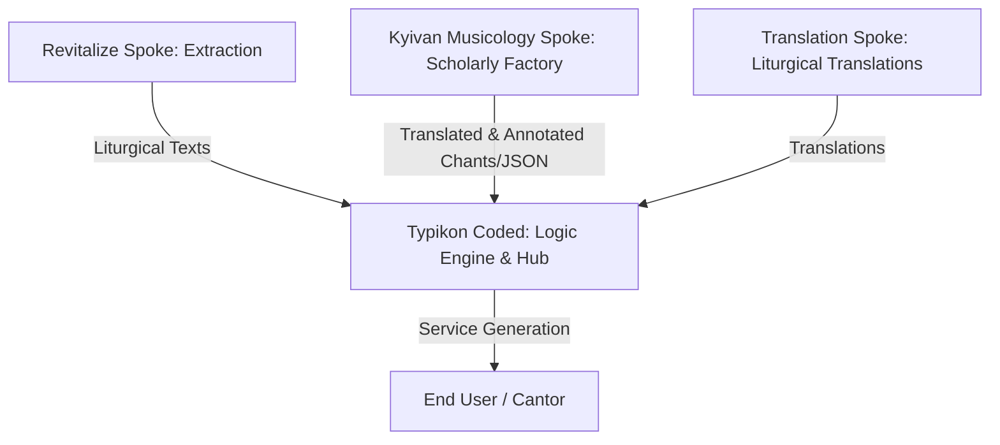

# Onboarding Assessment & Brain Control Analysis

This document provides a comprehensive review of the active agent control files, rules, and protocols governing the **Kyivan Musicology** project. It outlines our findings, contrasts rules between the Hub and Spokes, and details the technical and operational impacts on our workflow.

---

## 1. Project Context & Ecosystem Architecture

The **Kyivan Musicology** project does not function in isolation; it is part of a larger multi-project ecosystem structured around a **Hub-and-Spoke** architecture:

### Key Alignment Rules
* **Our Role (The Scholarly Factory):** We focus exclusively on translation, scholarly enrichment, indexing (e.g., Yasinovsky Catalogue), and mapping musical notation (e.g., MEI encoding). We do **not** write logic engine rules—that is the sole domain of the **Typikon Coded Hub**.
* **Global Bulletin Board:** We must post major milestones to [GLOBAL_ECOSYSTEM_STATE.md](file:///c:/Users/augus/OneDrive/Documents/Google%20Antigravity/Projects/GLOBAL_ECOSYSTEM_STATE.md).
* **The Handoff Protocol:** Completed JSON/MD data assets must be shipped directly to the Hub's inbox at `C:\Users\augus\OneDrive\Documents\Google Antigravity\Projects\Typikon Coded\Data\Inbox\` alongside a `handoff_note.md` detailing schemas and methodology.

---

## 2. Directory Structure & Key Files

The following files represent the **Single Source of Truth** and control center of the project, located under the `_brain/` folder:

| File Path | Role & Operational Rules |
| :--- | :--- |
| [_brain/PROJECT_BRAIN_PRINT.md](file:///C:/Users/augus/OneDrive/Documents/Google%20Antigravity/Projects/Kyivan%20Musicology/Irmologia%20Catalogue/_brain/PROJECT_BRAIN_PRINT.md) | **Ecosystem Baseline:** Documents active priorities across Wing A, B, and C, checksums, file system alignments, API offloading protocols, and previous session histories. |
| [_brain/workflow_state.md](file:///C:/Users/augus/OneDrive/Documents/Google%20Antigravity/Projects/Kyivan%20Musicology/Irmologia%20Catalogue/_brain/workflow_state.md) | **Active Frontiers:** Tracks the precise entry number and text chunks where the last session stopped. Tells us exactly what to work on next. |
| [_brain/system_instructions.md](file:///C:/Users/augus/OneDrive/Documents/Google%20Antigravity/Projects/Kyivan%20Musicology/Irmologia%20Catalogue/_brain/system_instructions.md) | **Wing A Instructions:** Prescribes JSON schemas, physical metadata parsing rules, and linguistic/OCR normalization glossaries for manuscript cataloging. |
| [_brain/Translation_Protocol_Articles.md](file:///C:/Users/augus/OneDrive/Documents/Google%20Antigravity/Projects/Kyivan%20Musicology/Irmologia%20Catalogue/_brain/Translation_Protocol_Articles.md) | **Wing B Instructions:** Outlines strict rules for scholarly articles: no summarization, complete footnote fidelity, and the Dual-Phase Transcription pipeline. |
| [Irmologia Catalogue/.cursorrules](file:///C:/Users/augus/OneDrive/Documents/Google%20Antigravity/Projects/Kyivan%20Musicology/Irmologia%20Catalogue/.cursorrules) | **Execution Safe-Guards:** Outlines path policies, API offloading boilerplate, and environment-specific constraints. |

---

## 3. Operational Protocols & Constraints

### 3.1 DeepSeek API Offloading (Dual-AI Environment)
To bypass context limits and avoid local Gemini quota issues (`RESOURCE_EXHAUSTED`), we must offload heavy/bulk tasks (translating large texts, fuzzy-sorting lists, bulk renaming) to the **DeepSeek API** using the key stored in:
`C:\Users\augus\OneDrive\Documents\Google Antigravity\Projects\.env`

* **Thinking Toggle:** Set `"thinking": {"type": "disabled"}` in extra body params for visual OCR and standard text mapping to save tokens and costs.
* **Chunking Directive:** Scripts must actively chunk text before calling the API to prevent timeouts.

### 3.2 Dual-Mirror Taxonomy
Manuscript files are split strictly between two repositories:
1. **Offline Repository (`E:\Irmologia JPG`):** Contains **PURELY IMAGES** and `.md` metadata files. No PDFs allowed.
2. **Cloud Repository (`E:\Google Drive\Liturgical Library\...`):** Contains **PURELY PDFs** and `.md` metadata files. No JPGs allowed.
3. Both folders share the exact same 3-tier subfolder taxonomy: *1. Yasinovsky Catalogue, 2. Supplementary, 3. Historical Printed Editions*.

### 3.3 Safety & Validation Rules
* **Mandatory Dry-Runs:** No file deletions or bulk moves without dry-running and printing paths first.
* **Trust but Verify:** After any move/cleanup, we must programmatically query directories (`os.listdir` / `Get-ChildItem`) to verify counts, rather than trusting stdout prints.
* **UTF-8 Enforcement:** Because files are heavily Cyrillic/Church Slavonic, all Python reads/writes must use `encoding='utf-8'`. PowerShell operations must explicitly use `-Encoding UTF8` to avoid mojibake (ANSI/cp1252 corruption).
* **Google Drive Sync Locks:** Never use Python's `shutil.rmtree` or `os.rmdir` on Drive folders. Google Drive sync locks cause access denied crashes. Always use PowerShell's `Remove-Item -Force -Recurse`.

---

## 4. Current State & Immediate Operational Next Steps

Based on [workflow_state.md](file:///C:/Users/augus/OneDrive/Documents/Google%20Antigravity/Projects/Kyivan%20Musicology/Irmologia%20Catalogue/_brain/workflow_state.md), here is our current progress:

### Wing A: Catalogue Data Pipeline (~51% Complete)
* **Status:** 279 manuscript entries translated and extracted into English Markdown with JSON payloads.
* **Next Target:** Batch 35 (No. 410, 411, 412, 414, 415).
* **Source:** `2.4-kat-253-446-2.txt` (from Lviv, LNB / National Museum archives).
* **Validation:** Run `catalogue_validator.py` and `comprehensive_validator.py` after processing.

### Wing B: Scholarly Translation Pipeline (Stabilized & Packaged)
* **Status:** The 25 Kalophonia corpus translations (and their audits) are complete. The UCU bibliography translation and compiling of 51 PDFs using Playwright are complete. Rebuild of 1709 Incipitary and Mishchenko's dissertation are complete.
* **Immediate Priority:** **Typikon Hub Integration (Extraction Phase)**.
  * Extract structural chant rules, regional variants (Suprasl, Skete), and liturgical logic from the 25 translated articles/audits into a structured JSON matrix. This matrix will serve as the reference engine for the central Typikon Coded Hub.

### Digital Archive & URL Acquisition
* **Status:** 173 manuscripts downloaded. 15 targets remain pending (11 Yasinovsky URLs and 4 NLB targets).
* **Next Steps:** Execute scripted downloads to reconcile pending URL items and sync them to `E:\Irmologia JPG` (compiled) and Google Drive (PDFs).

---

## 5. Hub vs. Spoke Rule Differences

A side-by-side comparison of rules in the Hub (`Typikon Coded`) vs. the Spoke (`Kyivan Musicology`):

| Aspect | Typikon Coded (Hub) | Kyivan Musicology (Spoke) |
| :--- | :--- | :--- |
| **Primary Focus** | Liturgical logic engine, service digests, rubric resolvers. | Text translation, manuscript cataloging, structural metadata. |
| **Strict Translation Rules** | Uses flattened asset keys (no raw translations in engine). | Dual-Phase pipeline, no summarization, complete footnote fidelity. |
| **API Offloading** | Offloads large St. Sergius parsing and menu mappings. | Offloads bulk translations, manuscript parsing, and vision OCR. |
| **Validation Methods** | pytest (`test_matins_stress_2_saints.py`, `test_matins_gold_standard.py`). | `catalogue_validator.py`, `comprehensive_validator.py`, `markdown_validator.py`. |
| **Handoff Location** | Target of incoming text (`Data/Inbox/`). | Source of incoming text (`Data/Inbox/` target). |
| **Evidence Gate** | Pytest counts, generated digest diffs. | Validator outputs, folder sync counts. |
