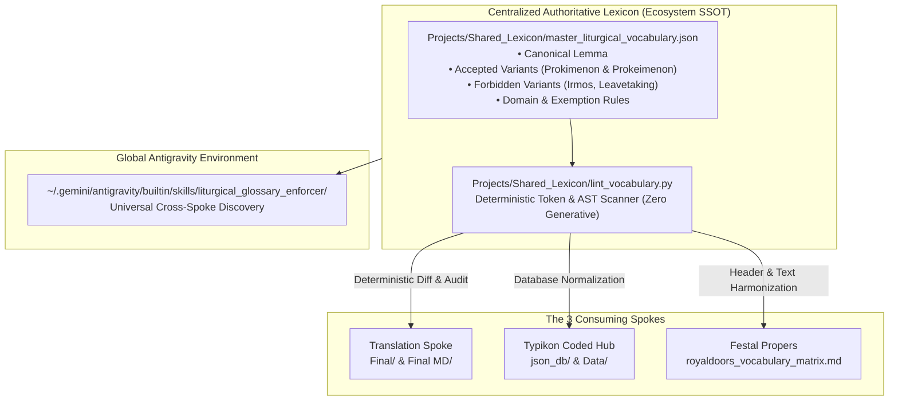

# Master Ecosystem Implementation Plan: Data-Driven Remediation & Cross-Spoke Harmonization
## Resolving Vocabulary Collisions, Database Contaminations, and Tooling Silos Across Translation, Typikon Coded, and Festal Propers

This plan defines an iterative, deterministic, and strictly code-gated roadmap to remediate all identified defects across the four Antigravity ecosystem spokes:
1. **Translation Spoke** (`Projects/Translation`)
2. **Typikon Coded Hub** (`Projects/Typikon Coded`)
3. **Festal Propers Comparisons** (`Projects/Festal Propers Comparisons`)
4. **Shared Infrastructure & Global Skills** (`Projects/Shared_Lexicon` & Global Skills)

---

## Issue Inventory & Root Cause Matrix

| Issue ID | Affected Spoke(s) | Severity | Root Cause | Description |
|---|---|---|---|---|
| **ISSUE-01** | `Translation` ↔ `Festal Propers` | **Critical** | Conflicting Local Standards | **Intersystem Transliteration Collision**: Translation mandates `Prokimenon` (canonical) and rejects `Prokeimenon`; Festal Propers mandates `Prokeimenon` and marks `Prokimenon` as deprecated. Similar split on `Exaposteilarion` (`ei`) vs `Exapostilarion` (`i`). |
| **ISSUE-02** | `Typikon Coded` (`json_db/`) | **High** | Corrupted Ingestion | **Footnote Contamination (FN 775 & 784)**: Over 40,000 characters of duplicate liturgical body chunks (items 130–146, 216–261) embedded into footnote definitions in `synodal_footnotes.json`. |
| **ISSUE-03** | `Typikon Coded` (`json_db/`) | **High** | Incomplete Draft Sync | **Dropped Footnote Block (FN 241–278)**: 38 footnotes for September Menaion rubrics set to `"typikon_part": "unknown"` with empty anchors in `synodal_footnotes.json`. |
| **ISSUE-04** | `Typikon Coded` (`json_db/`) | **Medium** | Offset Anchor Collision | **FN 360 Misanchoring**: Footnote 360 mapped to September 1 instead of January 11 (St. Theodosius the Cenobiarch). |
| **ISSUE-05** | `Typikon Coded` (`json_db/` & `Data/`) | **Medium** | Legacy Lexicon Drift | **Vocabulary Drift in Hub**: 20+ instances of deprecated `irmos` and `service book` in `synodal_footnotes.json` and `Canonical_English_Lexicon.json`. |
| **ISSUE-06** | `Festal Propers` | **Medium** | Script Anti-Pattern | **Pseudo-Database Ingestion**: `normalize_service_header()` loads JSON database but ignores it, relying on brittle `if in` hardcodes and fragile `parents[1]` paths. |
| **ISSUE-07** | Ecosystem Skills | **Medium** | Workspace Siloing | **Skill Fragmentation**: Duplicate skills (`liturgical_glossary_enforcer` vs `liturgical_vocabulary_standardizer`) locked inside individual project folders, invisible across sibling workspaces. |
| **ISSUE-08** | `Translation` (`Final_footnotes.md`) | **Low** | Historical Citations | **Verbatim Citation Drift**: 4 occurrences of `Lytia` in footnotes ([^118], [^143], [^160], [^211]) quoting 19th-century Slavonic/Russian chapter titles. |

---

## Master Architecture: The Universal Single Source of Truth (SSOT)



---

## Detailed Remediation Phases

### Phase 1: Establish Ecosystem Master Lexicon & Adjudicate Collisions (SSOT)
**Target**: `Projects/Shared_Lexicon/master_liturgical_vocabulary.json` & `adjudication_rules.md`

- [ ] **Task 1.1**: Create `Projects/Shared_Lexicon/` directory at the ecosystem root.
- [ ] **Task 1.2**: Author `master_liturgical_vocabulary.json` with a multi-layered schema:
  - `lemma`: Core liturgical concept.
  - `canonical_ugcc`: Canonical synodal English form.
  - `accepted_variants`: Permitted equivalents (e.g. `Prokimenon` and `Prokeimenon`; `Exaposteilarion` and `Exapostilarion`).
  - `forbidden_variants`: Strictly rejected variants (e.g. `Irmos`, `Irmoi`, `Leavetaking`, `Samohlasen`, `Podiben`, `Service Book` standalone).
  - `exemption_scopes`: Regex contexts exempt from flagging (e.g., verbatim historical source citations in footnotes, comparative editorial glossaries).
- [ ] **Task 1.3**: Resolve the `Prokimenon` vs. `Prokeimenon` inter-spoke contradiction:
  - Adjudicate both as valid liturgical transliterations in `accepted_variants`.
  - Prohibit either spoke from flagging the other's accepted form as an error.

### Phase 2: Build Centralized Deterministic Linter Engine
**Target**: `Projects/Shared_Lexicon/lint_vocabulary.py`

- [ ] **Task 2.1**: Implement invariant workspace root discovery:
  ```python
  def find_ecosystem_root() -> Path:
      curr = Path(__file__).resolve()
      for parent in [curr] + list(curr.parents):
          if (parent / "Translation").exists() and (parent / "Typikon Coded").exists():
              return parent
      raise RuntimeError("Cannot resolve Ecosystem Root")
  ```
- [ ] **Task 2.2**: Build O(1) exact-match and word-bounded regex tokenizers (`\b...\b`).
- [ ] **Task 2.3**: Implement markdown AST parser that skips code blocks (`` ` ``), verbatim blockquotes (`>`), and historical citation patterns.
- [ ] **Task 2.4**: Implement structured JSON diff reporting:
  - Flags file path, line number, column, matched token, rule status, and suggested replacement.
- [ ] **Task 2.5**: Implement `--apply-fixes` mode with strict UTF-8 enforcement and atomic file writes.

### Phase 3: Typikon Coded Hub Database Decontamination & Rehydration
**Target**: `Typikon Coded/json_db/synodal_footnotes.json`, `Data/Canonical_English_Lexicon.json`

- [ ] **Task 3.1**: **Decontaminate FN 775 and 784**:
  - Truncate the 40k corrupted characters in `synodal_footnotes.json`.
  - Restore clean, single-sentence definitions matching `Translation/Final/Final_footnotes.txt`.
- [ ] **Task 3.2**: **Wire Dropped Footnote Block 241–278**:
  - Update `typikon_part` from `"unknown"` to `"part3_menaion"`.
  - Populate service sections and anchors matching the restored September Menaion rubrics in `Data/Inbox/Final_Dolnytsky_part3_menaion.md`.
- [ ] **Task 3.3**: **Re-anchor Colliding Footnotes**:
  - Relocate `FN 360` from September 1 to January 11 (St. Theodosius).
  - Wire section anchors for restored `FN 406` (Annunciation Case 4) and `FN 502`.
- [ ] **Task 3.4**: **Normalize Hub Vocabulary**:
  - Run `lint_vocabulary.py --apply-fixes` across `synodal_footnotes.json` and `Data/Canonical_English_Lexicon.json`.
  - Eliminate all occurrences of `irmos` and `service book`.
- [ ] **Task 3.5**: **Test Suite Verification**:
  - Run `pytest tests/test_synodal_footnotes.py` in Typikon Coded. Assert 786/786 footnotes valid.

### Phase 4: Festal Propers Script & Skill Refactoring
**Target**: `Festal Propers Comparisons/` and Global Skills

- [ ] **Task 4.1**: Refactor `Festal Propers Comparisons/standardized_liturgical_vocabulary.json` to link directly to `Shared_Lexicon/master_liturgical_vocabulary.json`.
- [ ] **Task 4.2**: Replace the hardcoded `if in` Python snippet in Festal Propers with the true data-driven `normalize_service_header()` function querying `master_liturgical_vocabulary.json`.
- [ ] **Task 4.3**: Update `royaldoors_vocabulary_matrix.md` to classify `Prokimenon` under `Accepted Alternative` rather than `Deprecated / Typos`.
- [ ] **Task 4.4**: Promote `liturgical_glossary_enforcer` to:
  `C:\Users\augus\.gemini\antigravity\builtin\skills\liturgical_glossary_enforcer\`
  Ensure it is globally visible to any agent across all workspaces.

### Phase 5: Translation Spoke Exemption Annotation & Final Audit
**Target**: `Translation/Final MD/` and `scratch/deterministic_auditor.py`

- [ ] **Task 5.1**: Whitelist the 4 historical citations in `Final_footnotes.md` ([^118], [^143], [^160], [^211]) using the master lexicon exemption pattern.
- [ ] **Task 5.2**: Run `lint_vocabulary.py` against `Final/` and `Final MD/`:
  - Assert 0 unexempted forbidden variants.
- [ ] **Task 5.3**: Run `scratch/deterministic_auditor.py`:
  - Assert Critical = 0, High = 0, Medium = 0, Bijectivity = 786/786.
- [ ] **Task 5.4**: Run `scratch/search_anti_patterns.py` to ensure 0 code regressions.

### Phase 6: Global Status Synchronization & Release Sign-Off
**Target**: `GLOBAL_ECOSYSTEM_STATE.md`

- [ ] **Task 6.1**: Update `GLOBAL_ECOSYSTEM_STATE.md` recording:
  - Ecosystem SSOT deployment at `Projects/Shared_Lexicon/`.
  - Typikon Coded Hub database rehydration status.
  - Zero-defect audit certification across all 4 repositories.

---

## Verification & Exit Criteria

| Gate | Execution Command | Success Criteria |
|---|---|---|
| **Ecosystem Linter Gate** | `py Projects/Shared_Lexicon/lint_vocabulary.py --all-spokes` | Exit Code 0, 0 unexempted violations |
| **Typikon Coded Test Gate**| `pytest tests/test_synodal_footnotes.py` (in Typikon Coded) | Exit Code 0, 786 footnotes valid |
| **Translation Auditor Gate** | `py scratch/deterministic_auditor.py` (in Translation) | Exit Code 0, 0 Critical, 0 High, 786/786 Bijective |
| **Anti-Pattern Gate** | `py scratch/search_anti_patterns.py` | Exit Code 0, 0 new violations |
